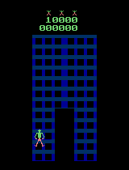
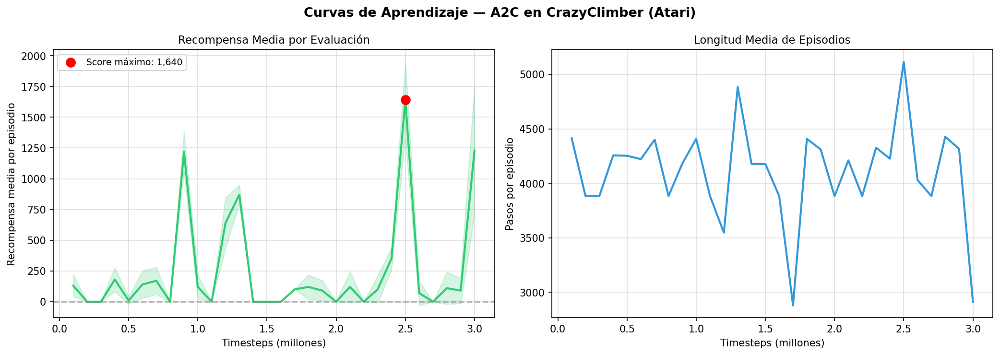

# Agente A2C para Atari CrazyClimber 🧗

**Taller 2 — Curso de Aprendizaje por Refuerzo**  
Maestría en Machine Learning & Deep Learning · 2025  
Juan Sebastián Londoño

---

## Descripción

Implementación de un agente **Advantage Actor-Critic (A2C)** entrenado sobre el juego
CrazyClimber del Arcade Learning Environment (ALE), usando Stable-Baselines3 y Gymnasium.

El agente aprende directamente desde píxeles crudos (frames 210×160 RGB) sin ninguna
ingeniería de características específica del dominio. El estado efectivo consiste en
4 frames preprocesados apilados de shape `(4, 84, 84)`, permitiendo inferir la velocidad
y dirección de los obstáculos en movimiento.

---

## Resultados

| Métrica | Valor |
|---|---|
| Score máximo (eval determinista) | **1,640 puntos** |
| Score final (3M steps) | 1,230 puntos |
| Agente aleatorio (referencia) | ~250 puntos |
| Mejora sobre aleatorio | **6.6×** |
| Steps totales de entrenamiento | 3,000,000 |
| Tiempo de entrenamiento | ~2.5 horas |
| Infraestructura | Kaggle GPU Tesla T4 |

---

## Demo del agente



---

## Curvas de aprendizaje



Las curvas muestran el patrón de **policy oscillation** característico de A2C: periodos
de mejora seguidos de caídas temporales, tras las cuales el agente rebota a niveles
superiores. El score máximo de 1,640 puntos se alcanzó en el step 2,500,000.

---

## Arquitectura del agente

```
Input (4, 84, 84)
    → Conv2D(32 filtros, 8×8, stride 4) + ReLU   → (32, 20, 20)
    → Conv2D(64 filtros, 4×4, stride 2) + ReLU   → (64, 9, 9)
    → Conv2D(64 filtros, 3×3, stride 1) + ReLU   → (64, 7, 7)
    → Flatten                                      → 3,136
    → Dense(512) + ReLU                            → 512 (compartido)
         ├── Dense(9) + softmax  →  π(a|s)  [Actor]
         └── Dense(1)            →  V(s)    [Critic]

Parámetros entrenables: 1,689,258
```

**Función de pérdida:**
```
L_total = L_actor + 0.5·L_critic - 0.01·L_entropy
```

---

## Hiperparámetros

| Parámetro | Valor |
|---|---|
| Algoritmo | A2C (Advantage Actor-Critic) |
| n_envs | 8 (ambientes paralelos síncronos) |
| n_steps | 128 |
| learning_rate | 7e-4 |
| gamma (γ) | 0.99 |
| ent_coef (β) | 0.01 |
| vf_coef | 0.5 |
| max_grad_norm | 0.5 |
| total_timesteps | 3,000,000 |

---

## Estructura del repositorio

```
taller_2/
├── README.md
├── Agente_RL_CrazyClimber_v2.pdf    # Informe teórico + resultados experimentales
├── crazy-climber-final.ipynb         # Notebook completo de entrenamiento (Kaggle)
├── models/
│   ├── best_model.zip                # Mejor modelo guardado (1,640 pts)
│   └── a2c_crazyclimber_final.zip    # Modelo al finalizar el entrenamiento
└── results/
    ├── curvas_aprendizaje.png         # Curvas de recompensa y longitud de episodios
    └── agente_crazyclimber.gif        # Demo del agente jugando
```

---

## Reproducibilidad

El notebook está diseñado para correr en **Kaggle con GPU T4 x2**.

```
1. Crear nuevo notebook en Kaggle
2. Settings → Accelerator → GPU T4 x2
3. Subir crazy-climber-final.ipynb
4. Run All
```

**Dependencias instaladas automáticamente en el notebook:**
```
stable-baselines3[extra]
gymnasium[atari]
autorom[accept-rom-license]
```

Para continuar el entrenamiento desde un checkpoint:
```python
from stable_baselines3 import A2C

model = A2C.load('models/best_model.zip', env=train_env, device='cuda')
model.learn(
    total_timesteps     = 1_000_000,
    reset_num_timesteps = False,   # continúa desde donde quedó
)
```

---

## MDP — Especificación formal

| Componente | Especificación |
|---|---|
| Estado S | `(4, 84, 84)` — 4 frames en escala de grises |
| Acciones A | `Discrete(9)` — movimientos del joystick |
| Transición P | Emulador ALE + frame skip 4 + sticky actions |
| Recompensa R | Delta de score clipeado a {-1, 0, +1} |
| Descuento γ | 0.99 |
| Episodio | Termina al perder la vida activa |

---

## Referencias

1. Mnih, V., et al. (2013). *Playing Atari with Deep Reinforcement Learning.* arXiv:1312.5602.
2. Mnih, V., et al. (2015). Human-level control through deep reinforcement learning. *Nature, 518*, 529–533.
3. Mnih, V., Badia, A. P., et al. (2016). Asynchronous methods for deep reinforcement learning. *ICML 2016.*
4. Machado, M. C., et al. (2018). Revisiting the Arcade Learning Environment. *JAIR, 61*, 523–562.
5. Raffin, A., et al. (2021). Stable-Baselines3. *JMLR, 22*(268), 1–8.
6. Farama Foundation. (2023). *ALE Documentation.* https://ale.farama.org
